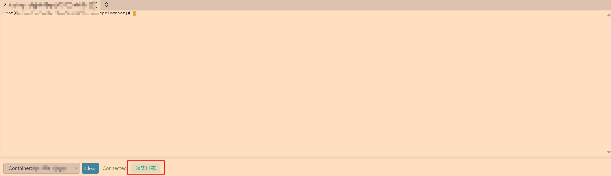
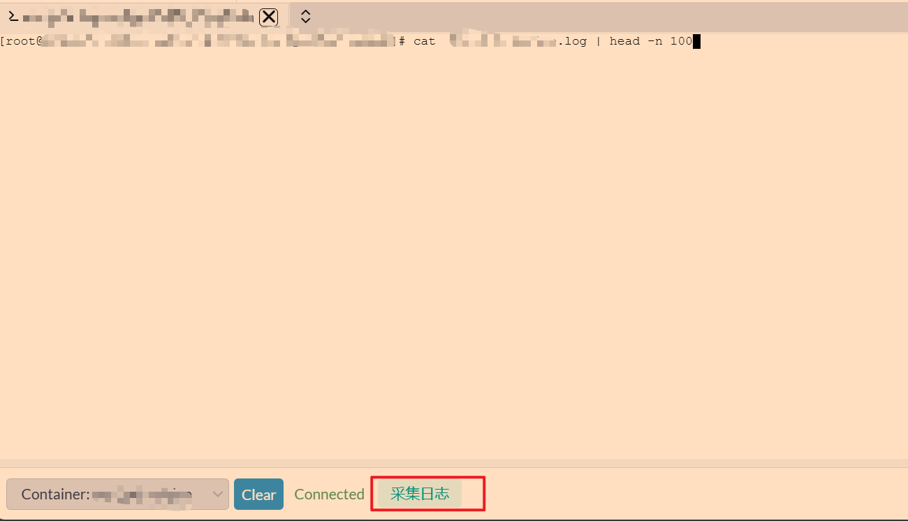
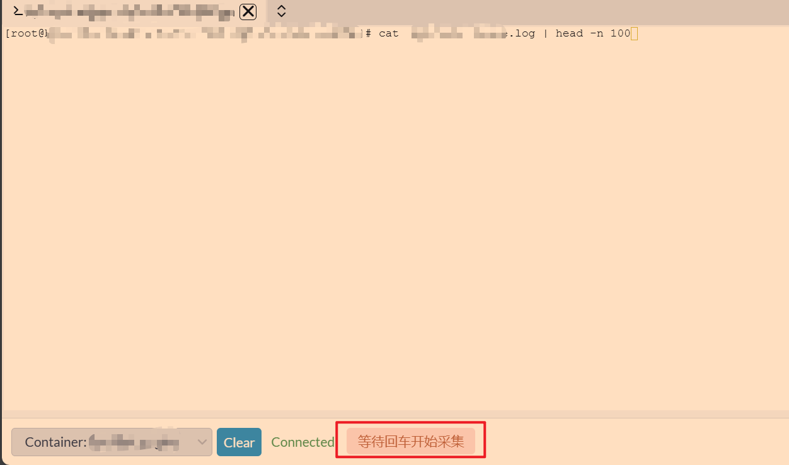
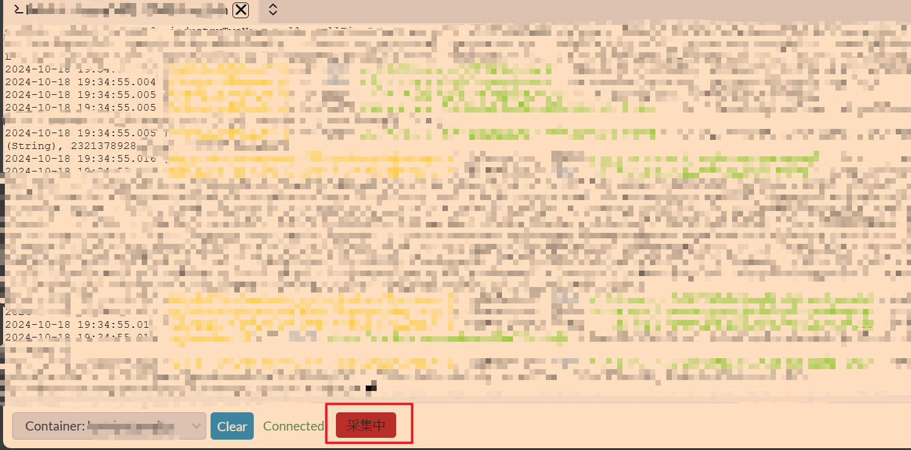
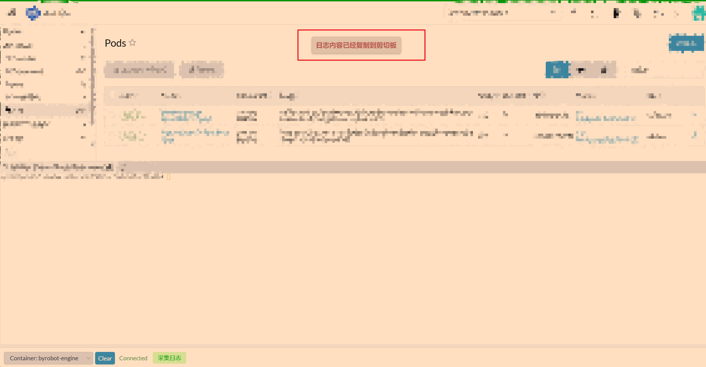

# rancher-collect-log-ext
用于rancher 收集容器中的日志扩展 （Log extension used in rancher collection container）

## 痛点
- rancher中进入容器，通过关键字查询到某些日志，但是在rancher中查看不清晰，不够方便。同时rancher也没有提供一键复制出日志数据的功能。
- 脚本支持一键采集出容器中应用日志。方便复制到其他可视化工具中查看。

## 安装
- 请先安装油猴(tampermonkey)或者其他脚本管理器
  - [https://www.tampermonkey.net/index.php](https://www.tampermonkey.net/index.php)
- 然后访问地址安装
  - [rancher-collect-log-ext](https://greasyfork.org/zh-CN/scripts/513072)

## 使用
- 下载完成后请将脚本@match后的地址修改为你的rancher控制台地址
- 保存脚本，然后打开rancher页面，进入容器
- 底部title处会多出一个采集日志的按钮
  
- 输入你要查询的日志命令（先不要回车）
  
- 然后点击采集日志按钮，按钮变为等待回车开始采集
  
- 然后回车，开始日志采集，按钮变为采集中
  
- 最后点击采集中按钮，完成采集。日志数据自动粘贴到剪切板。
  